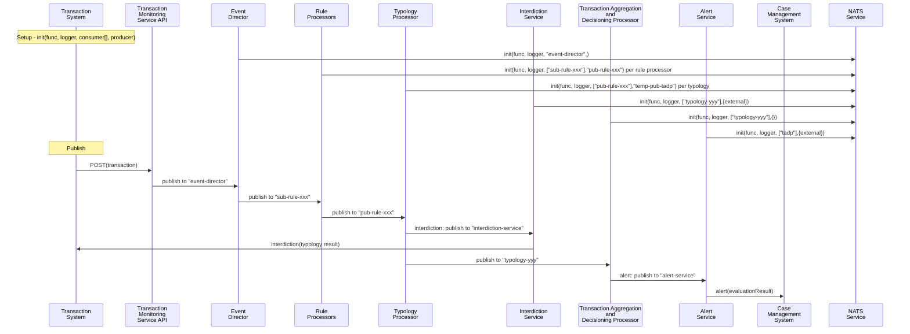

<!-- SPDX-License-Identifier: Apache-2.0 -->

## Table of Contents

- [Overview](#overview)
- [Installation](#installation)
- [Usage](#usage)
- [Modules and Classes](#modules-and-classes)
- [Sequence Diagram](#sequence-diagram)
- [Configuration](#configuration)
- [Contributing](#contributing)
- [License](#license)

## Overview

`frms-coe-startup-lib` is a library designed to facilitate how messages are transmitted across microservices in the Tazama ecosystem. The library is a wrapper around [NATS](https://nats.io), allowing for flexible and scalable service deployment.

Key features:
- **Service Initialization**: Abstractions for initializing NATS.
- **Message Handling**: Standardized interfaces for processing incoming messages.
- **Configuration Management**: Tools for loading and managing service-specific configurations.
- **Logging**: Integration with custom logging services for consistent log management across services.

## Installation

The npm package is hosted on GitHub. Make sure you're authenticated with GitHub and have the necessary permissions to access the package (`read:packages`). Create a [`.npmrc`](https://docs.npmjs.com/cli/v9/configuring-npm/npmrc?v=true) file if you currently do not have. Add the following content:
```.rc
@tazama-lf:registry=https://npm.pkg.github.com
//npm.pkg.github.com/:_authToken=some-secret
```
Replace "some-secret" with your GitHub Token.

To install the `frms-coe-startup-lib` package, you can use npm.

1. **Install via npm:**

   ```sh
   npm install @tazama-lf/frms-coe-startup-lib
   ```


2. **Importing in your project:**

Once installed, you can import the library in your project:

  ```typescript
  import { StartupFactory } from '@tazama-lf/frms-coe-startup-lib';
  ```

3. **Dependencies:**

    Ensure that you have all required dependencies installed, including any specific versions of third-party packages mentioned in the package's peer dependencies.

4. **Environment Configuration:**

    Set up your environment configuration using a `.env` file or environment variables. Refer to the library's [template](.env.template.nats) for details on necessary environment variables.

## Usage

The `frms-coe-startup-lib` library provides an abstraction for initializing and managing NATS. This includes encoding the payload before sending it as well as decoding the payload after it has been received. It includes the `StartupFactory` and `IStartupService` interface for creating and managing services.

### **Initializing a Service**

The `StartupFactory` class initializes NATS. It implements the `IStartupService` interface. The `init` method of the `IStartupService` interface sets up the service to listen for incoming messages. The `onMessageFunction` callback is called with each received message.

**Example:**
```typescript
import { IStartupService } from '@tazama-lf/frms-coe-startup-lib';

async function handleTransaction(req: unknown) {
    console.log('received transaction', req)
}

const server: IStartupService = new StartupFactory();
server.init(handleTransaction);
```

This library uses protobuf to encode and decode messages. The format is defined in the [`frms-coe-lib`](https://github.com/tazama-lf/frms-coe-lib/blob/9151cb58dfa7feeff4bc932cc4ea7d3f43c85a49/src/helpers/proto/Full.proto#L6) and for your message to be transmitted without any data loss, you should ensure it conforms to the protobuf definition.

The `init` function has **optional** parameters
```js
  async init(
    onMessage: onMessageFunction,
    loggerService?: ILoggerService,
    parConsumerStreamNames?: string[],
    parProducerStreamName?: string,
      ): Promise<boolean> {}
```

#### `loggerService`
If provided in the call to `init()`, will use this for internal logging.

#### `parConsumerStreamNames`
If provided in the call to `init()`, this will be a list of consumers that this connection will send messages to. If not provided, an environment variable: `CONSUMER_STREAM`, is read.

To specify multiple consumers, specify comma separated values of your consumers:
```sh
CONSUMER_STREAM=ConsumerA,ConsumerB,ConsumerC
```
Will configure `ConsumerA`, `ConsumerB` and `ConsumerC` as consumers.

#### `parProducerStreamName`
If provided in the call to `init()`, this will be a subject to listen for messages on. If not provided, an environment variable: `PRODUCER_STREAM`, is read.

## Modules and Classes

1. **Startup Factory**

  - **Class**: StartupFactory
    - **Description**: Manages the initialization and handling of the message broker
    - **Methods**:
      - `init(onMessage: onMessageFunction, loggerService?: ILoggerService, parConsumerStreamNames?: string[], parProducerStreamName?: string): Promise<boolean>`: Initializes the startup service.
      - `initProducer(loggerService?: ILoggerService, parProducerStreamName?: string): Promise<boolean>`: Initializes the producer stream.
      - `handleResponse(response: object, subject?: string[]): Promise<void>`: Handles responses from the startup service.

2. **NATS Service**

  - **Class**: NatsService
    - **Description**: Manages the initialization and handling of NATS services, including subscribing and publishing messages.
    - **Methods**:
      - `init(onMessage: onMessageFunction, loggerService?: ILoggerService, parConsumerStreamNames?: string[], parProducerStreamName?: string): Promise<boolean>`: Initializes the NATS service.
      - `initProducer(loggerService?: ILoggerService, parProducerStreamName?: string): Promise<boolean>`: Initializes the producer stream for NATS.
      - `handleResponse(response: object, subject?: string[]): Promise<void>`: Handles responses and publishes them to the producer stream.
      - `subscribe(subscription: Subscription, onMessage: onMessageFunction): Promise<void>`: Subscribes to a NATS subject and processes incoming messages.

3. **Interfaces**

  - **Interface**: IStartupConfig
    - **Properties**:
      - `startupType: 'nats'`: The type of service to start.
      - `ackPolicy: 'None' | 'All' | 'Explicit' | 'NotSet'`: Acknowledgment policy.
      - `producerStorage: string`: Storage type for the producer.
      - `producerStreamName: string`: Name of the producer stream.
      - `producerRetentionPolicy: string`: Retention policy for the producer.
      - `consumerStreamName: string`: Name of the consumer stream.
      - `serverUrl: string`: URL of the server.
      - `env: string`: Environment.
      - `functionName: string`: Queue name for NATS messages
      - `streamSubject: string`: Stream subject.

  - **Interface**: IStartupService
    - **Methods**:
      - `init(onMessage: onMessageFunction, loggerService?: ILoggerService, parConsumerStreamNames?: string[], parProducerStreamName?: string): Promise<boolean>`: Initializes the startup service.
      - `initProducer(loggerService?: ILoggerService, parProducerStreamName?: string): Promise<boolean>`: Initializes the producer stream.
      - `handleResponse(response: object, subject?: string[]): Promise<void>`: Handles responses.

  - **Interface**: ILoggerService
    - **Methods**:
      - `log(message: string): void`: Logs a message.
      - `warn(message: string): void`: Logs a warning message.
      - `error(message: string | Error): void`: Logs an error message.

4. **Types**

  - **onMessageFunction**
    - **Type**: `(reqObj: unknown, handleResponse: responseCallback) => Promise<void>`
      - **Description**: Represents a function to handle incoming messages.
      - **Parameters**:
        - `reqObj: unknown`: The request object.
        - `handleResponse: responseCallback`: The callback to handle the response.

  - **responseCallback**
    - **Type**: `(response: object, subject: string[]) => Promise<void>`
      - **Description**: Represents a callback function to handle responses.
      - **Parameters**:
        - `response: object`: The response object.
        - `subject: string[]`: The subject(s) to which the response should be sent.

## Sequence Diagram


```mermaid
flowchart LR

    TS[Transaction<br>System] --> TMS[Transaction<br>Monitoring<br>Service API]
    TMS --> EDin[event-director]:::nats
    EDin --> ED[Event<br>Director]
    ED --> RPin001[sub-rule-001@1.0.0]:::nats & RPin500[...]:::nats & RPin999[sub-rule-999@1.0.0]:::nats
    RPin001 --> RP001[Rule<br>Processor<br>001]
    RPin500 --> RP500[...]
    RPin999 --> RP999[Rule<br>Processor<br>999]
    RP001 --> RPout001[pub-rule-001@1.0.0]:::nats
    RP500 --> RPout500[...]:::nats
    RP999 --> RPout999[pub-rule-999@1.0.0]:::nats
    RPout001 --> TypP[Typology<br>Processor]
    RPout500 --> TypP[Typology<br>Processor]
    RPout999 --> TypP[Typology<br>Processor]
    TypP --> Typ001[typology-001@1.0.0]:::nats & Typ500[...]:::nats & Typ999[typology-999@1.0.0]:::nats & IS[interdiction-service]:::nats
    Typ001 --> TADP[Transaction Aggregation<br>and<br>Decisioning Processor]
    Typ500 --> TADP
    Typ999 --> TADP
    TADP --> AS[Alert<br>Service]:::nats

    NATS[NATS<br>Subject]:::nats

    classDef nats stroke:#00f,stroke-width:4px;
```


## Configuration

### Environment Variables

The `frms-coe-startup-lib` library uses environment variables to configure the startup process and service connections. Key environment variables include:

- `STARTUP_TYPE`: Specifies the startup type (`nats`).
- `NODE_ENV`: The node environment (`development`, `production`, etc.).
- `SERVER_URL`: The URL of the server (e.g., NATS server).
- `FUNCTION_NAME`: The name of the function or service.
- `PRODUCER_STREAM`: The name of the producer stream.
- `CONSUMER_STREAM`: The name of the consumer stream.

### Configuration Files

The library supports configuration through [`.env`](.env.template.nats) files or other configuration file formats. These files can be used to set environment variables and other settings.

### Logging Configuration

Logging can be configured using environment variables or configuration files. Options include:

- **Log Levels**: Set the desired log level (e.g., `info`, `debug`, `warn`).
- **Log Outputs**: Specify where the logs should be sent (console, file, external services).

### Stream and Subject Configuration

The library can be configured to interact with specific streams and subjects in the message broker. These are specified using the `PRODUCER_STREAM`, `CONSUMER_STREAM`, and `STREAM_SUBJECT` environment variables.

## Contributing

If you want to contribute to the `frms-coe-startup-lib`, please clone the repository and submit a pull request to the `dev` branch.

## License

This library is a component of the Tazama project. The Tazama project is licensed under the Apache 2.0 License.
